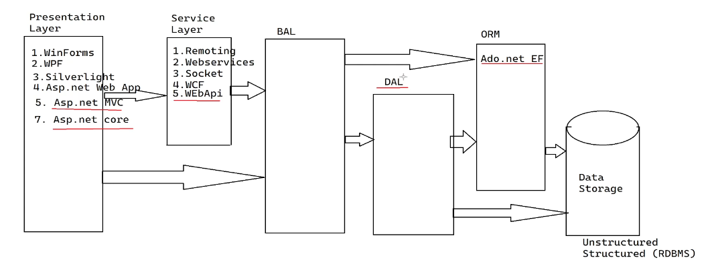
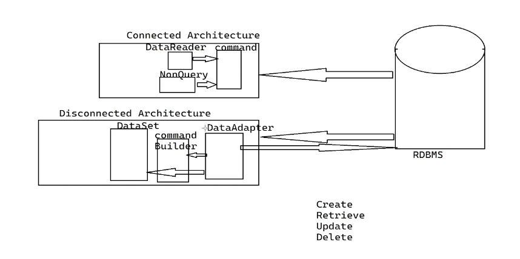
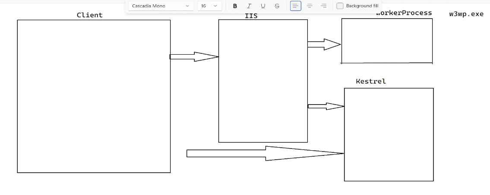

## Lecture - 1

Presentation Layer
    Service Layer
        BAL - Bussiness Access Layer
            DAL - Data Access Layer
                ORM - Object Realtional Mapping

------------------------------------------
## Lecture - 2

Query & Non-query

------------------------------------------
## Lecture - 3

For ASP.net App - 
IIS - Internet Information Server

For ASP.net Core -
Any Platform - Linux, Mac, etc

Controller - recieves the request and redirect to the end point. ex - model

Model - the schema of the data

# Create ASP.net Web App -
- Create a new project
- Select -> ASP.net Web App
- Project Name -> ? -> Empty -> Options -> MVC